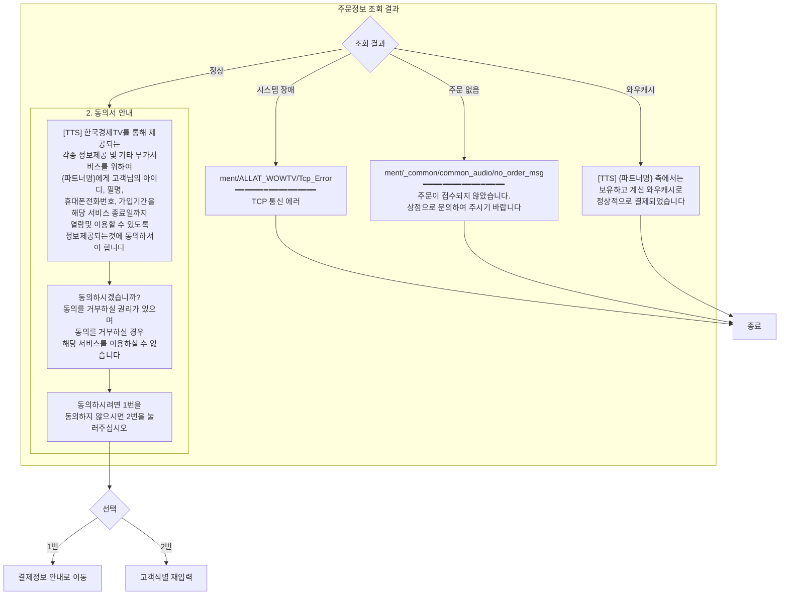

# 한국경제TV ALLAT ARS 결제 시나리오 Flowchart

## 1. 전체 시나리오 흐름도 (Main Flow)

---

## 2. 상세 Flowchart (멘트 포함)

### 2-1. 인사말 및 고객식별

### 2-2. 주문정보 조회 및 동의서

### 2-3. 결제금액 및 해지조건 안내

### 2-4. 카드정보 입력

### 2-5. 결제처리 및 종료

---

## 3. 시스템 에러 처리 Flow

---

## 4. 입력 오류 처리 Flow

---

## 5. 전체 멘트 파일 목록

| 순서 | 파일 경로 | 용도 |
|------|-----------|------|
| 1 | `audio/shop_intro/wownet_intro` | 인사말 |
| 2 | `ment/_common/common_audio/input_telnum_start` | 전화번호 입력 안내 |
| 3 | `audio/input_sms_start` | SMS 주문번호 입력 안내 |
| 4 | `audio/input_sms_msg` | 입력하신 주문번호는 |
| 5 | `ment/_common/common_audio/input_confirm` | 확인 (맞으면 1번, 틀리면 2번) |
| 6 | `ment/_common/common_audio/no_order_msg` | 주문 없음 안내 |
| 7 | `ment/ALLAT_WOWTV/Tcp_Error` | TCP 통신 에러 |
| 8 | `ment/_common/common_audio/input_card_num_var_nonghyup` | 카드번호 입력 (농협 불가 안내) |
| 9 | `ment/ALLAT_Hangung/input_cardexp_start` | 유효기간 입력 안내 |
| 10 | `ment/_common/common_audio/input_halbu_start` | 할부개월 입력 안내 |
| 11 | `ment/ALLAT_Hangung/input_halbu_start_ilsibul` | 무이자 할부 카드사 안내 |
| 12 | `ment/_common/common_audio/input_nohalbu_msg` | 일시불 선택 안내 |
| 13 | `ment/_common/common_audio/input_halbu_err` | 할부개월 오류 안내 |
| 14 | `ment/_common/common_audio/pay_success_msg` | 결제 완료 |
| 15 | `ment/_common/common_audio/pay_fail_msg` | 결제 실패 |
| 16 | `ment/_common/common_audio/service_end` | 정상 종료 |
| 17 | `ment/_common/common_audio/Error_end` | 에러 종료 |
| 18 | `ment/TTS_TimeOut` | 통화량 과다 |

---

*문서 작성일: 2026-01-29*
*소스 파일: ALLAT_Stockwin_Quick_New_Scenario.cpp*
